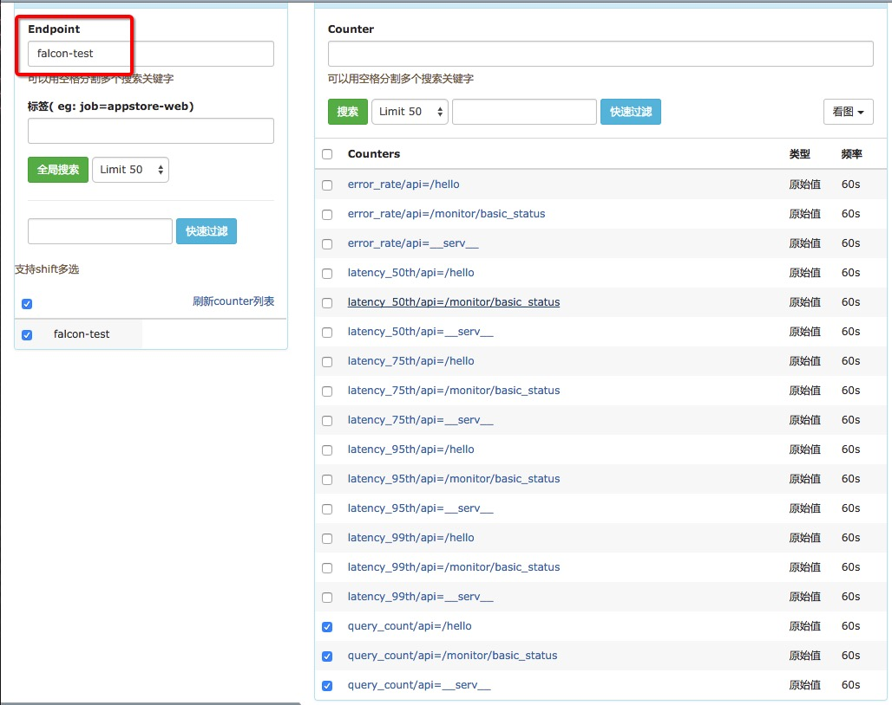
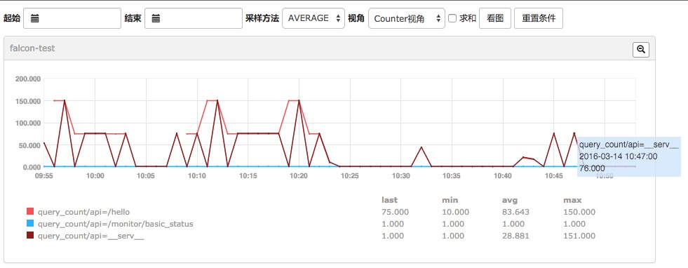

# Nginx-Metric

## Introduction
===========================

ngx_metric(Nginx-Metric) -- Open-Falcon的Nginx Web Server请求数据采集工具，主要包括流量大小、响应时间、异常请求统计等。

## 环境需求
--------------------------

System: Linux

Python: >= 2.6

Nginx+Lua

## 主要逻辑
--------------------------

通过lua nginx module的`log_by_lua_file`实时记录nginx请求数据，通过外部python脚本定时获取数据解析为Open-Falcon支持的数据类型。

## 汇报字段
--------------------------

|key|tag|type|note|
|---|---|---|---|
|query_count|api|GAUGE|nginx 正常请求(status code < 400)数量|
|error_count|api,errcode|GAUGE|nginx 异常请求(status code >= 400)数量|
|error_rate|api|GAUGE|nginx 异常请求比例|
|latency_{50,75,95,99}th|api|GAUGE|nginx 请求平均响应时间，按百分位统计|
|upstream_contacts|api|GAUGE|nginx upstream 请求次数|
|upstream_latency_{50,75,95,99}th|api|GAUGE|nginx upstream平均响应时间，按百分位统计|

> api tag: 即nginx request uri，各统计项按照uri区分。当api为保留字`__serv__`时，代表nginx所有请求的综合统计
>
> error_count、upstream统计项根据实际情况，如果没有则不会输出

## 使用方法
------------------------

### 配置nginx

* lua文件部署

``` shell
mkdir ${NGINX_HOME}/modules
cp lua/* ${NGINX_HOME}/modules/
```

* nginx配置文件加载

```shell
cp ngx_metric.conf ${NGINX_CONF}/conf.d/

# 确保nginx.conf include 该配置
...
include conf.d/*.conf;
...

```

* 配置uri长度截取【可选】

```shell
# 当uri过长，或者使用RESTful uri时，容易把具体ID带到uri进行统计，与实际情况相悖。
# ngx_metric里对uri进行了截断，默认是以"/"分隔，截取三段，可以自由配置

server {
    ...
    # 该server下uri统计时截取5段
    set $ngx_metric_uri_truncation_len 5;
    ...
}
```

### lua结果解析

* 测试

```shell
pip install requests   # 可选，使用`--falcon-addr`时需要执行

python nginx_collect.py --format=falcon
```

* 将脚本加入crontab

### nginx_collect.py 脚本参数说明

```shell
python nginx_collect.py -h

Usage: nginx_collect.py [options]

Options:
  -h, --help            show this help message and exit
  --use-ngx-host        use the ngx collect lib output host as service column,
                        default read self
  --service=SERVICE     logic service name(endpoint in falcon) of metrics, use
                        nginx service_name as the value when --use-ngx-host
                        specified. default is ngx_metric
  --format=FORMAT       output format, valid values "odin|falcon", default is
                        odin
  --falcon-step=FALCON_STEP
                        Falcon only. metric step
  --falcon-addr=FALCON_ADDR
                        Falcon only, the addr of falcon push api
  --ngx-out-sep=NGX_OUT_SEP
                        ngx output status seperator, default is "|"
```

> `--use-ngx-host`: 使用nginx配置里的`service_name`作为采集项的`endpoint`
>
> `--service`: 手动设置`endpoint`值，当指定`--use-ngx-host`时，该参数无效
>
> `--format`: 采集数据输出格式，对接falcon请使用`--format=falcon`
>
> `--falcon-step`: falcon step设置，请设置为python脚本调用频率，默认是60
>
> `--falcon-addr`: falcon push接口设置，设置该参数数据直接推送，不再输出到终端。需要安装`requests`模块

## Screenshot


----------------

